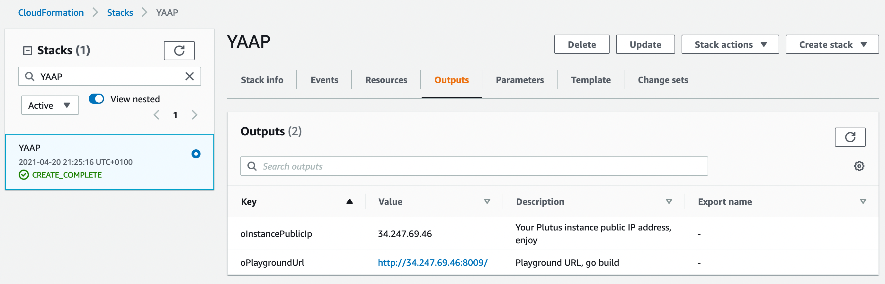

# YAAP - Yet Another Accessible Plutus (Playground)

A simple and cost-effective deployment of [Plutus Playground](https://playground.plutus.iohkdev.io/) on AWS. Our aim is to enable less infrastructure savvy folks to run their own Plutus deployment, develop, build and contribute to the Cardano ecosystem.

Brought to you by [SALTY](https://saltypool.net/) stakepool, the smart choice in a sea of opportunity.

## Why?

We recieved a question on reddit which made us think - _what would a novice developer wanting to dabble with Plutus need for a minimal setup?_. YAAP isn't aimed to replace the official Plutus [deployment](https://github.com/input-output-hk/plutus/tree/master/deployment) but rather to provide an accessible (and inexpensive) way of setting up a personal instance. Our estimate is that the cost of YAAP vs. a standard deployment is less than an 1/8.

## Getting Started

The following instructions will help you deploy the Plutus Playground to an AWS EC2 instance in your account where you can start tinkering. Estimated time to deploy is around half an hour.

### Prerequisites

- An AWS Account - follow the [steps](https://aws.amazon.com/premiumsupport/knowledge-center/create-and-activate-aws-account/) from Amazon on this
- Keen interest in the platform
- [Optional] basic familiarity with AWS and/or Linux

### Estimated Costs

**Overall daily**: $1 

**Breakdown**:
- Assuming use of N. Virginia (`us-east-1`)
- `t3a.medium` instance at $0.0376/hour = $0.9
- 30GB of `gp2` volume at $0.10/GB/month = $0.1

See the section _Keeping Costs Down_ further down on how to save costs when your deployment isn't in use (cut down costs to just those of storage).

## Deployment

The deployment is fully automated using Infrastructure-as-Code (AWS CloudFormation).

- Click

- Take note of the region in which you're deploying (top right hand corner of the AWS Console)
- The following parameters are required:
  - Stack name: a friendly name for this deployment, you can keep with the default (YAAP) or tweak as you wish
  - Instance Type: what size or type of Instance (VM)
    - We've included a set of more cost-efficient types (the `t3a` family), which are part of the general purpose family
    - Detailed cost information is available on the [AWS pages]
  - Key Pair:
    - This private and public key pair is used to connect to the Linux instance running Plutus, while it isn't required, you may want to connect to the "box" at some point (curiosity, patching etc.)
    - Put the Key Pair name you'd like to use in this field
    - More information is available on the [AWS documentation](https://docs.aws.amazon.com/AWSEC2/latest/UserGuide/ec2-key-pairs.html)
    - If unsure, keep it empty, this means you won't be able to connect via SSH ("terminal") **yet you will be able to use Plutus**
  - Image: keep the default, this will use the latest Amazon Linux machine image
  - Access: this field will define what IP range can access your Plutus deployment web-interface and machine
    - `0.0.0.0/0` means "anywhere" and we **strongly** recommend you change this
    - Use [this link](http://checkip.amazonaws.com/) to find your IP address and add a `/32` to the end of it
      - So say your IP address is `12.34.56.78`, put `12.34.56.78/32` as the value
- Click "Create stack"
- Within approximately 15 minutes the deployment will complete
  - Go grab a coffee/tea/drink while it runs and check back in a bit
  - How do you know it's done? the "Status" of your Stack will become _"CREATE_COMPLETE"_
  - Click the "Outputs" tab to get the address of your new environment (see image below)
  - It may take an extra minute or two for the address to load, this is because of the background startup occuring so don't be alarmed and add one drop of patience
- _Et voila!_ you're ready to start playing, tinkering and learning!

### Keeping Costs Down

One benefit with cloud is that you can turn off your instances (virtual machines) to minimize costs to only those relating to storage. Once you need the playground again, simply turn the instance on and play.

To stop the instance:
- Navigate to the [EC2 Console](https://console.aws.amazon.com/ec2/home), remember to verify your region in the upper right hand corner!
- Select your _"PlutusPlayground"_ Instance
- Click the "Instance state" button and select "Stop instance"

To start it again simply follow the same steps but choose "Start instance".

### Cleanup

So, you're done with your deployment and want to clean it up? easy! just please make sure you've either backed up your work or are happy to delete it along with the resources.

- Simply navigate to the [CloudFormation Console](https://console.aws.amazon.com/cloudformation/home), ensure you're in the region where you originally deployed YAAP (the selector in the top right-hand side of the AWS Console)
- Choose your Stack, if you stuck with our default name, it'll be _"YAAP"_
- Finally, press the "Delete" button and confirm your decision to delete the deployment

## Acknowledgments

- The IOHK team on their stellar job, specifically on [deployment](https://github.com/input-output-hk/plutus/tree/master/deployment) of Plutus
- [r/CardanoStakePools](https://www.reddit.com/r/CardanoStakePools/) and the broader Cardano community
